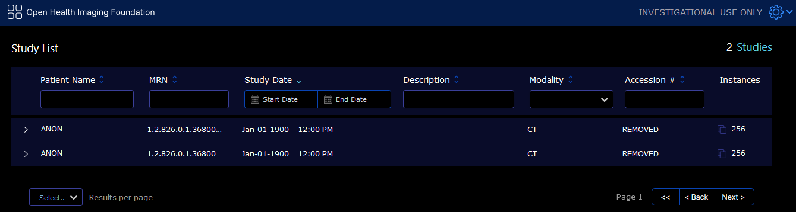
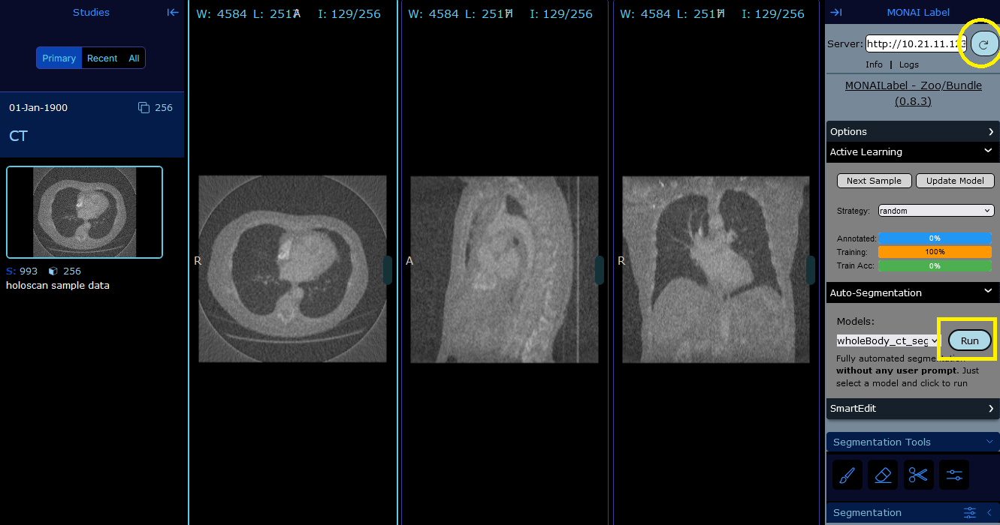

# CBCT Visualization and Analysis App

## Introduction

This is the visualization and analysis part of the CBCT reconstruction
pipeline. In this app, we will be able to:
- Launch an `Orthanc` DICOM server to store reconstructed CBCT volumes
  sent by the [recon app](../recon/README.md)
- Launch an OHIF viewer in the web browser to visualize the
  reconstructed volumes
- Use the MONAI Label module integrated in the OHIF viewer to
  perform anatomy segmentation of the CBCT volumes, using the
  [whole-body CT Segmentation
  model](https://github.com/Project-MONAI/model-zoo/tree/dev/models/wholeBody_ct_segmentation)
  from MONAI Model Zoo.

## Build and Run the App

Run the following script to build the image for running the app:
```
./build_image.sh
```

Then, run the following script to launch Orthanc and OHIF:
```
./run_visualization.sh
```
When running the app for the first time, you should wait for Orthanc,
OHIF to initialize and for MONAI Label to finish downloading and
loading the segmentation model. The app is ready when you see
something like the following in the console output:
```
...

[2024-08-01 15:38:19,673] [285] [MainThread] [INFO] (uvicorn.error:62) - Application startup complete.
[2024-08-01 15:38:19,673] [285] [MainThread] [INFO] (uvicorn.error:214) - Uvicorn running on http://0.0.0.0:8000 (Press CTRL+C to quit)

```

#### Access the Orthanc server

Open a browser and navigate to `http://localhost:8042/`. You will land
on the web-page for Orthanc server, where you can query, upload or
modify DICOM datasets (see figure below). The username and password
for authentication are both `orthanc`, and can be changed through
modifying the `RegisteredUsers` field in the [Orthanc config
file](orthanc/orthanc_config.json).

<p align="center">

</p>

#### Access the OHIF viewer

In the browser, navigate to `http://10.21.11.123:8000/ohif/`. You will
land on the web-page for OHIF viewer, where you can see a patient
worklist (see the first figure below). If the recon app has
previously sent volumes to Orthanc, you will see these volumes appear
here automatically.

<p align="center">

</p>

You can open a patient data and visualize the reconstructed volumes
for further analysis. The two figures below show the viewer panel. The
left figure displays the original reconstructed volume and the right
figure displays the denoised volume.

<p align="center">

&nbsp; &nbsp; &nbsp;

</p>

#### Run Automatic Segmentation

From the OHIF patient worklist, if you click ona patient, you can see
that there is a "MONAI Label" button. Click on this button, a viewer
will open that allows you to perform automatic segmentation of the
CBCT volumes using using the [whole-body CT Segmentation
model](https://github.com/Project-MONAI/model-zoo/tree/dev/models/wholeBody_ct_segmentation)
from MONAI Model Zoo. To do that, you might first need to click on the
refresh button in the "MONAI Label" tab (see the circle mark in the
figure below) for the model to appear. And then click on the "Run"
button in the "Auto-Segmentation" tab (see the rectangle mark in the
figure below). After waiting a couple of seconds, you should see the
segmentation masks pop-up in the same viewer window.

<p align="center">

</p>

The figures below show automatic segmentation results for the original
reconstructed volume (upper) and for the denoised volume (lower).

<p align="center">


</p>
